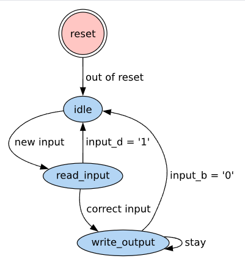

[](https://unlicense.org/)
[](https://daixiwen.github.io/typst-vhdl-parse/doc.pdf)


# VHDL-parse

`Vhdl-parse` is a typst module that parses VHDL files and extracts information from them that
can be presented in a typst document. It makes writing documentation for VHDL code easier and
lets use the VHDL code as single source of truth.

It only extracts information and provides it in structures. It is up to the user to format it
in a way to present it in a readable manner.

## Usage

Import the module and use the `parse` function to parse a VHDL file.

```typ
#import "@preview/vhdl-parse:0.1.0"

#let parsed-file = vhdl-parse.parse(
    "test.vhd", 
    read("test.vhd"))
```

You can then for example extract the generics from the VHDL file with the following command:

```typ
#let generics = vhdl-parse.generic-list(parsed-file)
```

Which will return an array similar to this:

```
(
  (
    name: "flag",
    generic-type: "boolean",
    constraint: none,
    description: "a flag, can be true or false",
    default-value: none,
  ),
  (
    name: "value",
    generic-type: "std_logic_vector",
    constraint: "(15 downto 0)",
    description: "a value with a default",
    default-value: "x\"DEAD\"",
  ),
)
```

The resulting array can for example be formatted into a table, following a specific template.

## Available functions

Please read the [documentation](https://daixiwen.github.io/typst-vhdl-parse/doc.pdf) for 
details. The following information can be extracted from the VHDL file:
- generics list
- ports list
- fsm states and transitions
- instances
- constants
- signals
- custom types

Additionnally, FSM information can be formatted to generate a figure using [diagraph](https://typst.app/universe/package/diagraph/)


